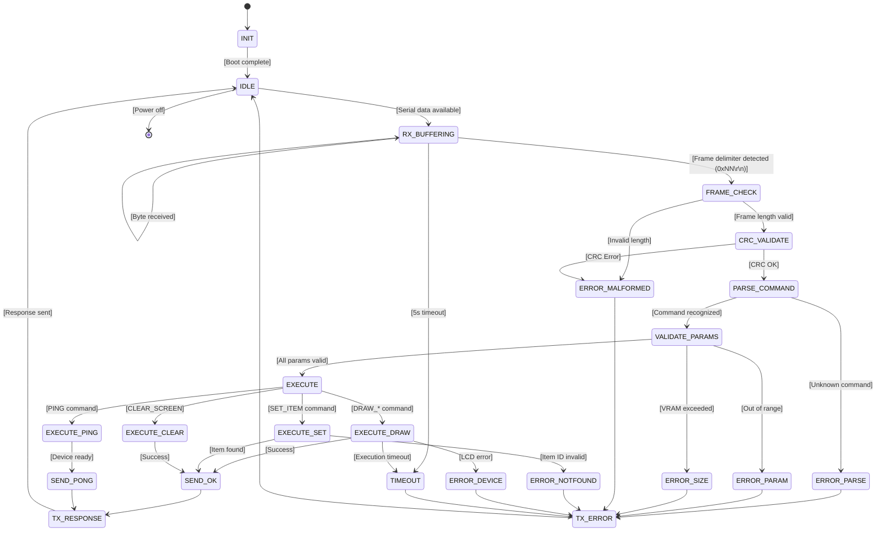
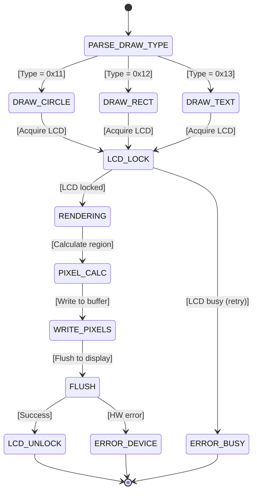
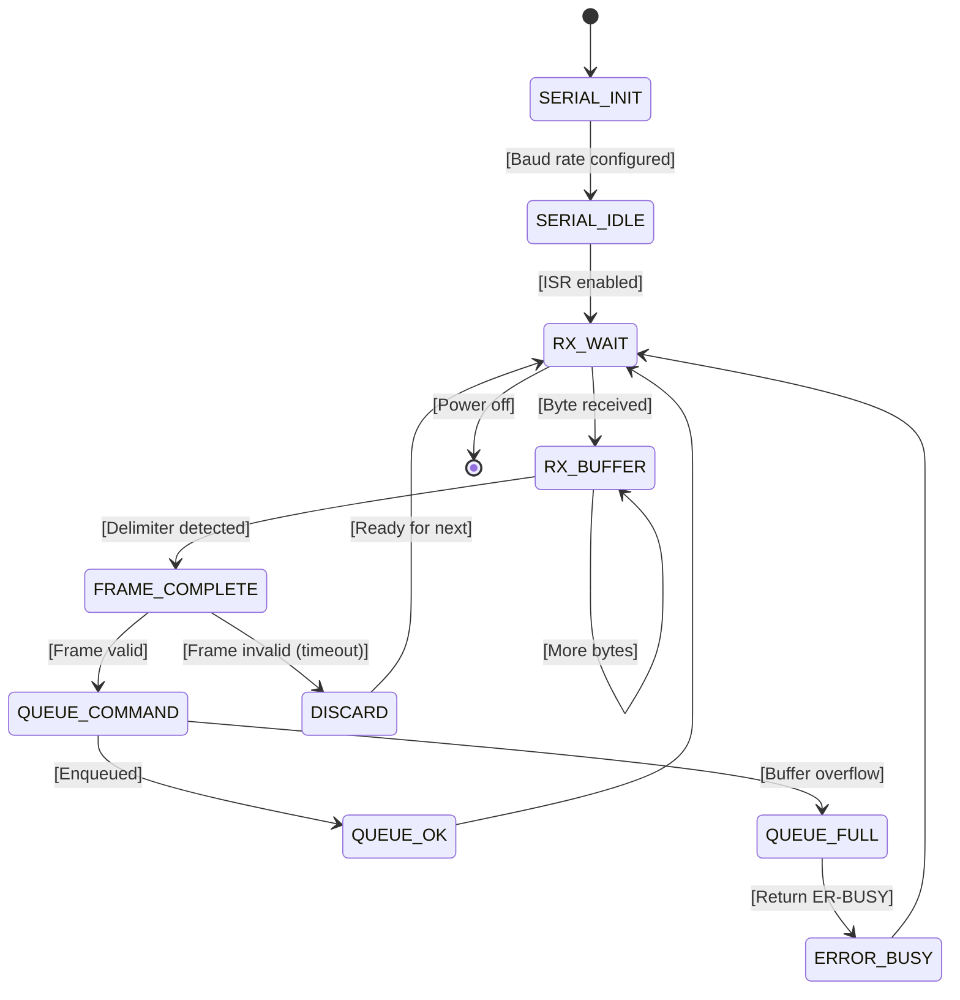
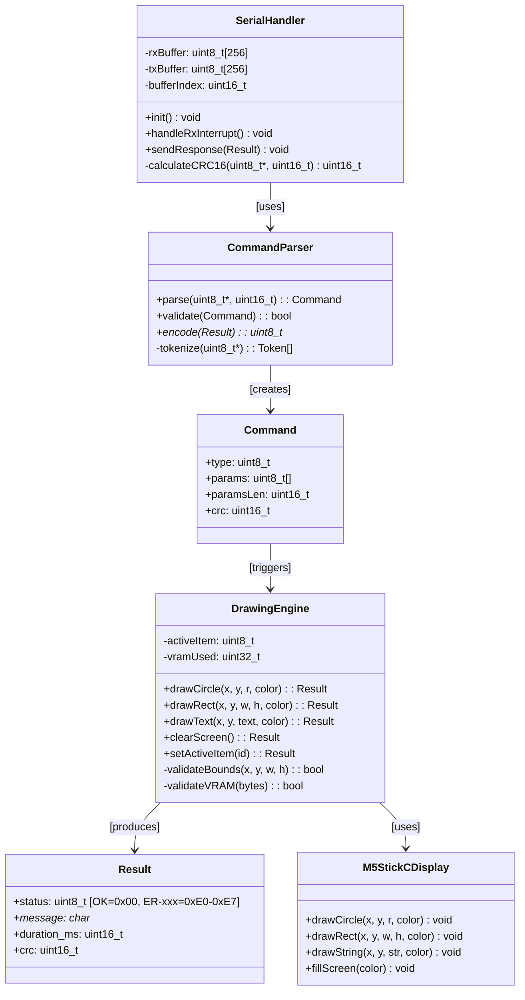
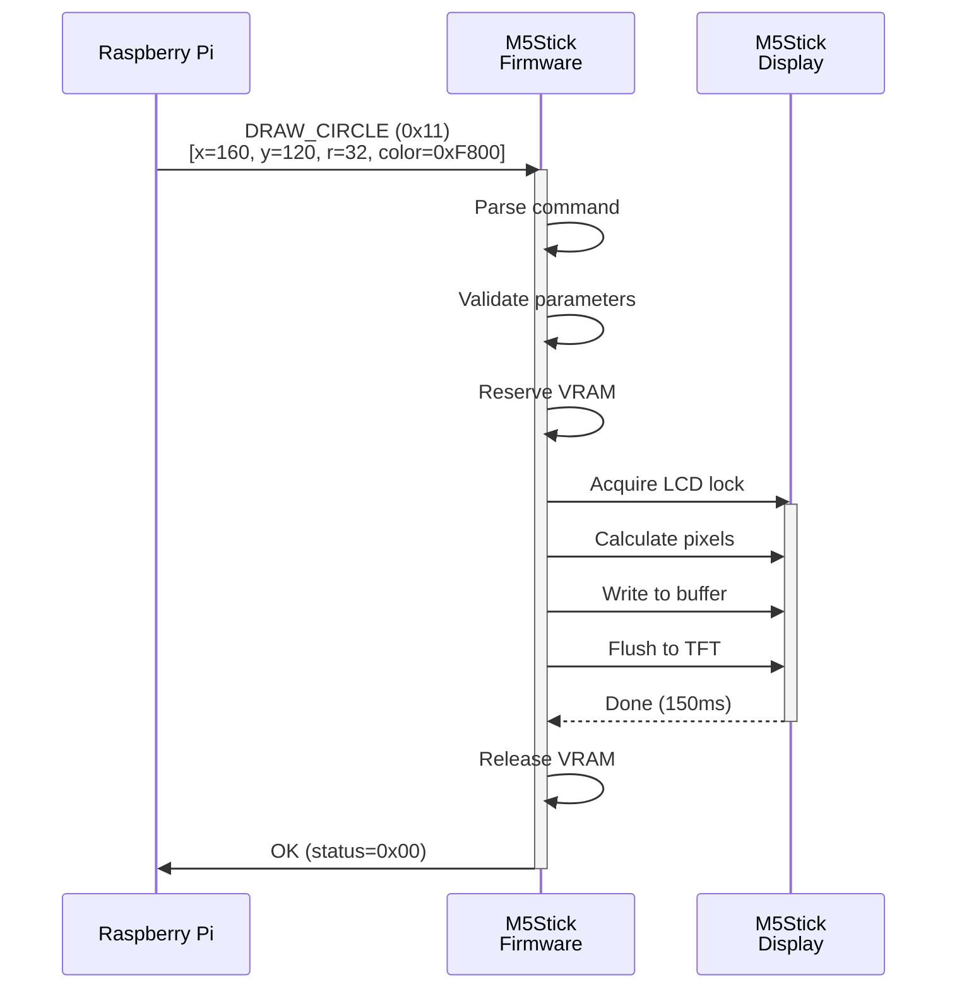
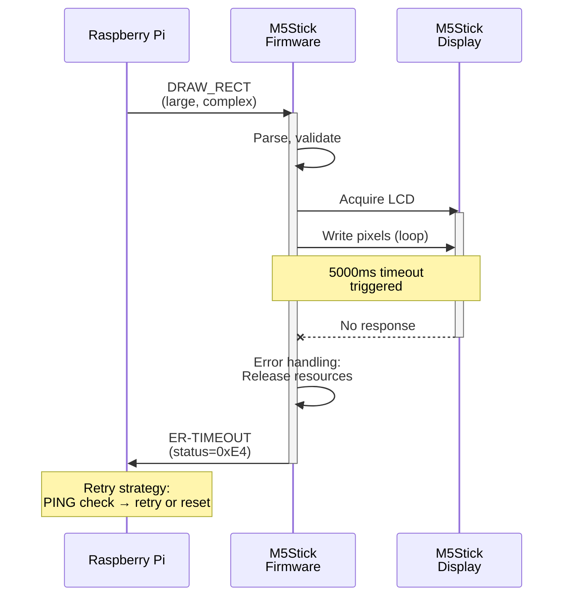
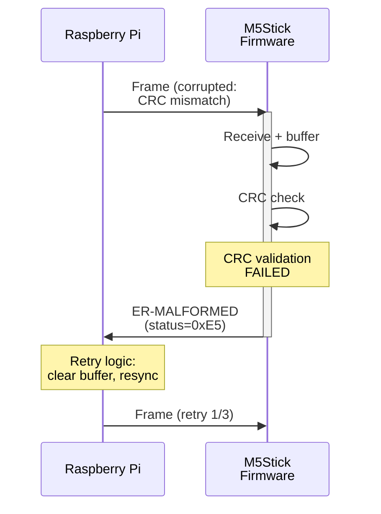

# UML 状態遷移図

**Task**: T018  
**Status**: Draft  
**Last Updated**: 2026-03-04

---

## 1. ファームウェア全体状態遷移図



---

## 2. 描画コマンド実行フロー (EXECUTE_DRAW)



---

## 3. シリアル通信状態遷移図



---

## 4. クラス図 (構造)



---

## 5. シーケンス図（正常系）



---

## 6. シーケンス図（エラー系：タイムアウト）



---

## 7. シーケンス図（エラー系：CRC エラー）



---

## 8. ステートマシン：責務分離

| モジュール | 責務 | 状態 |
|----------|------|------|
| **SerialHandler** | UART 割り込み, バッファ管理 | RX_WAIT → RX_BUFFER → FRAME_COMPLETE |
| **CommandParser** | フレーム解析, 妥当性チェック | PARSE → VALIDATE_PARAMS → EXECUTE |
| **DrawingEngine** | 画面描画, VRAM 管理 | LCD_LOCK → RENDERING → LCD_UNLOCK |
| **Main Loop** | 状態遷移の調整, 応答送信 | DISPATCH → ERROR_HDL → TX_RESPONSE → IDLE |

---

## 9. タイムライン（応答時間）

```
Timeline: DRAW_CIRCLE (5 秒 SLA)
─────────────────────────────────────────→ Time (ms)

[0]    Rx complete (Frame received)
 │
 ├─ [0-10]   Parse command
 ├─ [10-20]  Validate parameters
 ├─ [20-100] Reserve VRAM
 │           ↓
 ├─ [100-150] Execute drawing
 │   ├─ Acquire LCD lock (10ms)
 │   ├─ Calculate pixels (30ms)
 │   ├─ Write buffer (50ms)
 │   └─ Flush to display (50ms)
 │
 ├─ [150-160] Release resources
 │
 └─ [160-170] Send response Tx
             ↓
         [170] Response complete (✓ within 5000ms)
```

---

## 10. 変更履歴

| Version | Date | Changes |
|---------|------|---------|
| 1.0 | 2026-03-04 | Initial draft (State, Class, Sequence diagrams) |

