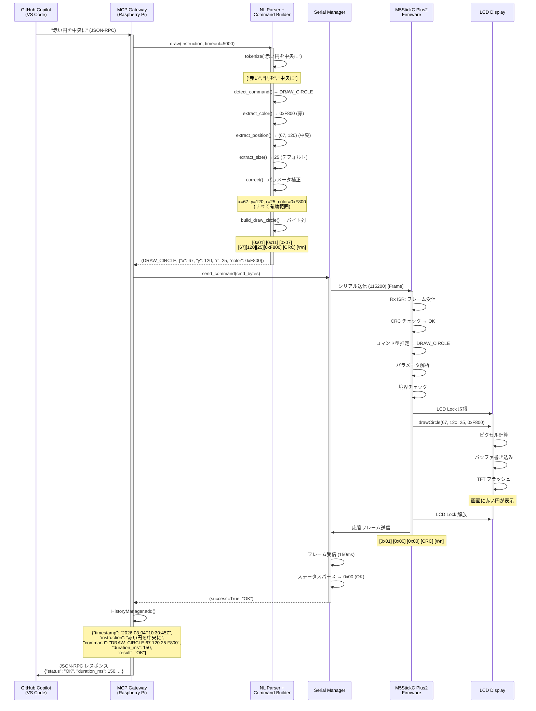
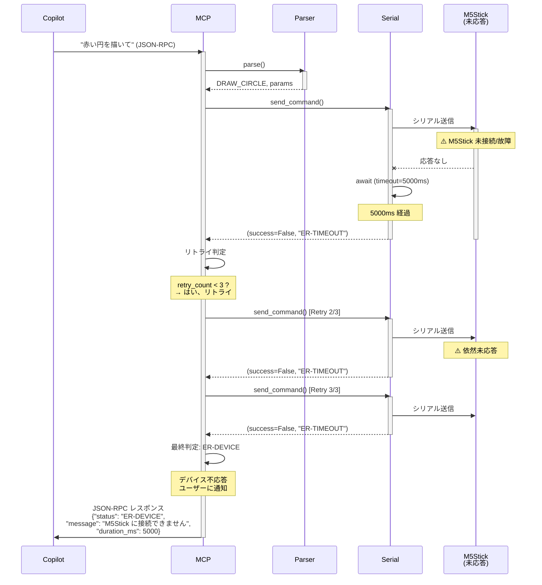
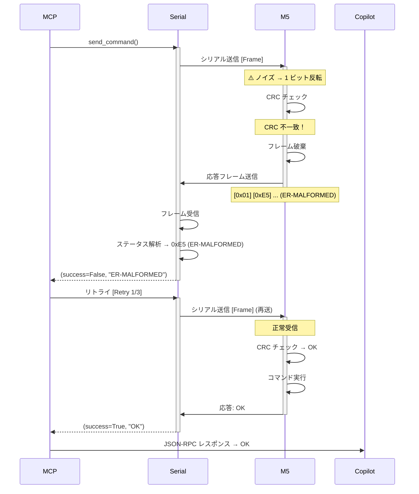
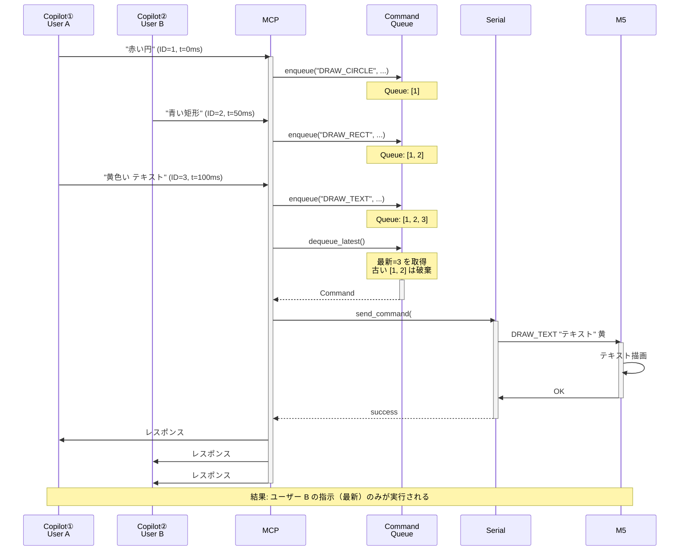
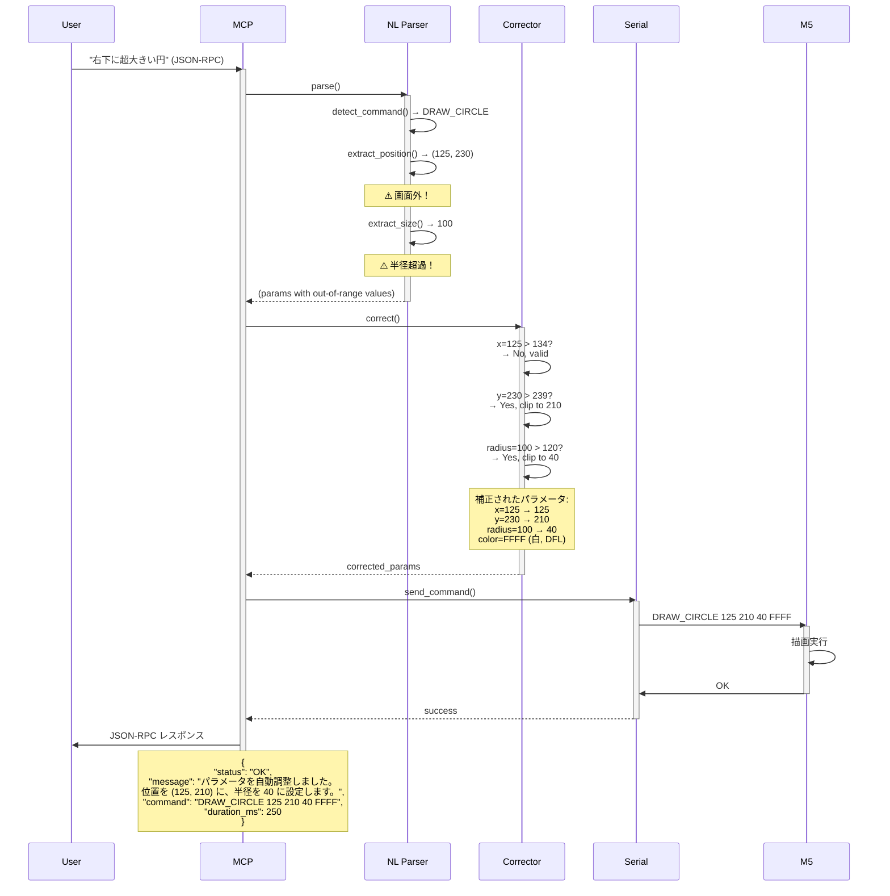
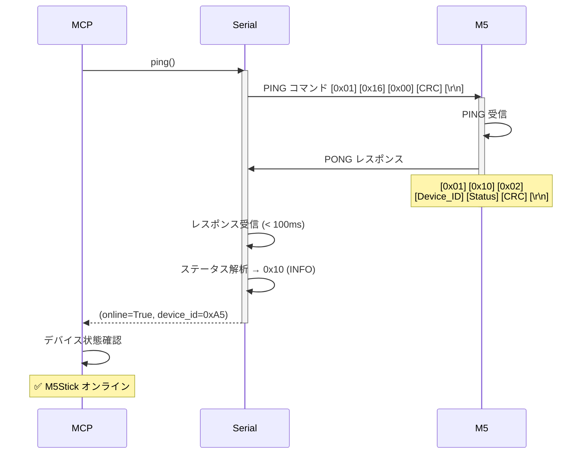
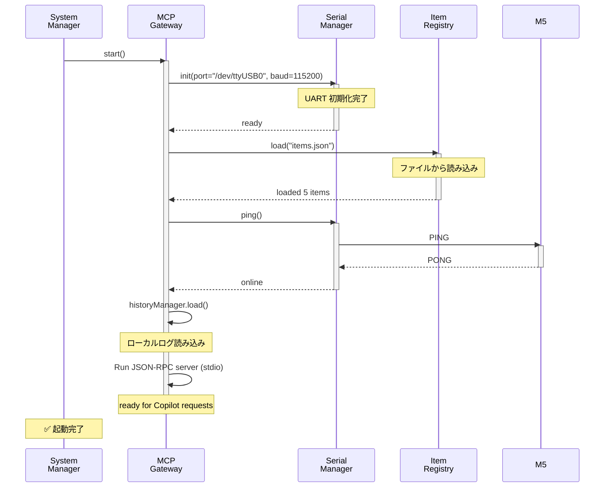
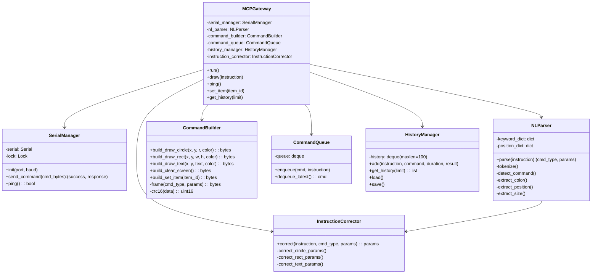

# UML シーケンス図 - MCP フロー

**Task**: T034  
**Status**: Draft  
**Last Updated**: 2026-03-04

---

## 1. 全体シーケンス図

---

## 2. エラーケース: タイムアウト

---

## 3. エラーケース: CRC エラー（フレーム破損）

---

## 4.複数指示：最新優先（SC-006）

---

## 5. 自動補正フロー（FR-015）

---

## 6. PING メソッド（デバイス確認）

---

## 7. 初期化フロー（起動時）

---

## 8. クラス相互作用図（動作時）

---

## 9. 変更履歴

| Version | Date | Changes |
|---------|------|---------|
| 1.0 | 2026-03-04 | Initial sequence diagrams (T034) |

